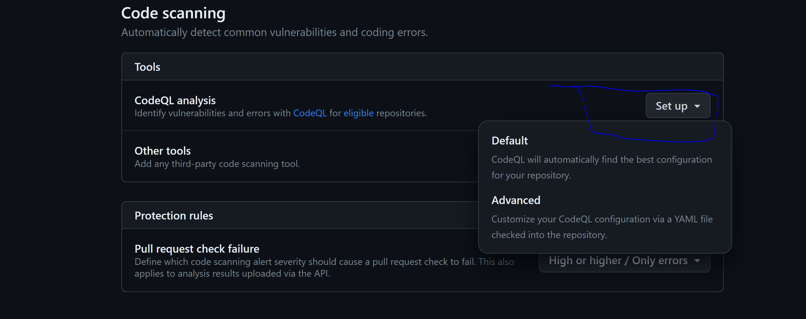
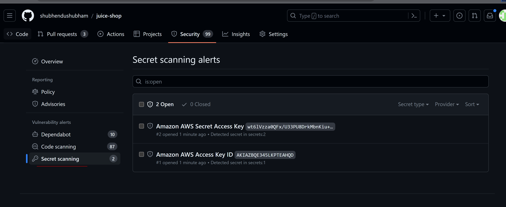
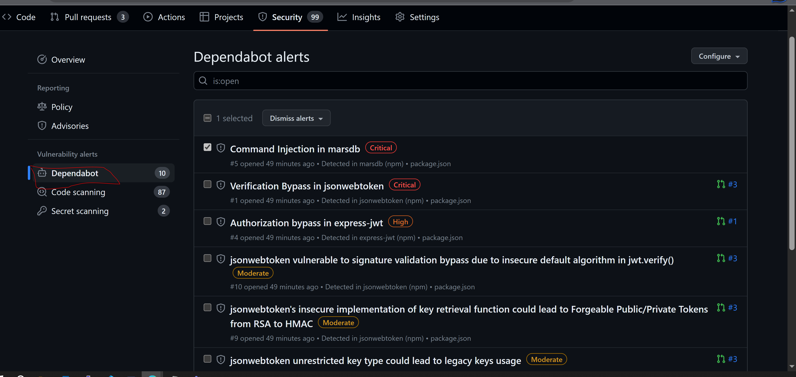

# azureblogathon

Enabling DevSecops best practices with Github Actions and GHSA (Github Advance security) with Azure.

Tabel of Content :

1. Devops with GitHub action 
2. DevOps challenges 
3. Architecture 
4. Github Advance security features and code & secrets scanning 

Before starting let's undestand a terms like What exactly is **Devops** and why do we need it? 

Answer : Devops is a methodology in the software development and IT industry used as a set of practice and tools.It is made of two words Dev which means Developer and Ops means Operations

We practice Devops in organisation for 
* improved quality of deployed applications
* Faster deployment cycle 
* faster release cycle 

What is DevSecops? 

Security practioners with Devops metholody is known as devsecops. now we do talk about shift left which means during each stage of code/ software development we are enabling security best practices to avoid future shortcomes.

**GitHub Actions**: Aka A Github way to do Devops 

* It is a powerful, flexible and world class CI/CD tool 
* Fully integrated with GitHUb
* Cross platform, Any language and Multi cloud support
* Secure, Scalable workflow automation for enterprise 

[Github Action Marketplace Link](https://github.com/marketplace?category=&query=&type=actions&verification=)


**Github Actions for Azure**

we can integrate directly with IDE or Azure DevOps .It comes with the following features 

* It helps us to deploy any language framework , any application to Azure directly from VS code / Visual studio code.
* It's simpler to use for various Azure Resources App service, AKS , Key Vault etc..
* It brings together strength of GitHub and Azure 

Diagram :-


**How to start with GitHub actiosn**

There are multiple ways to start 

- Github Portal- Action Tab 


- Azure Portal - Deployment center and Azure resource create experiences 


- Other Dev tools- Deploy to Azure CLI extension, Visual Studio Code extension 

**A few DevOps challenges**

 - Speed and Innovation : code to cloud Automation 
 - Security: "Shift left" & prevent vulnerabillities in source code before they are deployed into production 
 - Compliance : Policy as Code 
 - Governance : Audit and Tracebility 

 SDLC Architeure :-

 

 Let's understand this Architect Diagram:-

 * Dev Cluster : It's for devloper who writes code , test and Debug the code. Here it's integrated Dev environment which helps to code, Test and deploy continuously .

 * Github: Version Control to record the version of every commit. We can write automation interms of Build/Release then Test/Scans then Deploy to feature/main branch.

 * Everything as code : It is all about infrastructure as code. It contains Github Actions, ARM ,Azure Policy 
 
 * Infrastrucute Application Deployment: 

 * Policies for compliance and Governance: 
  
 * Monitor Logging : helps to monitor health metrics, Usage Metrics, CPU and COST 
 * Feedback loop :  

Deploying IaC  and automation with Github Actions for Azure 

Build container image and deploy to Azure Kubernetes Service cluster.

```
on: [push]
jobs:
  build:
    runs-on: ubuntu-latest
    steps:
    - uses: actions/checkout@master
    
    - uses: Azure/docker-login@v1
      with:
        login-server: contoso.azurecr.io
        username: ${{ secrets.REGISTRY_USERNAME }}
        password: ${{ secrets.REGISTRY_PASSWORD }}
    
    - run: |
        docker build . -t contoso.azurecr.io/k8sdemo:${{ github.sha }}
        docker push contoso.azurecr.io/k8sdemo:${{ github.sha }}
      
    # Set the target AKS cluster.
    - uses: Azure/aks-set-context@v1
      with:
        creds: '${{ secrets.AZURE_CREDENTIALS }}'
        cluster-name: contoso
        resource-group: contoso-rg
        
    - uses: Azure/k8s-create-secret@v1
      with:
        container-registry-url: contoso.azurecr.io
        container-registry-username: ${{ secrets.REGISTRY_USERNAME }}
        container-registry-password: ${{ secrets.REGISTRY_PASSWORD }}
        secret-name: demo-k8s-secret

    - uses: Azure/k8s-deploy@v1
      with:
        manifests: |
          manifests/deployment.yml
          manifests/service.yml
        images: |
          demo.azurecr.io/k8sdemo:${{ github.sha }}
        imagepullsecrets: |
          demo-k8s-secret
```
Now let's create Workflow for Github Action :

steps:
 1. Click on New Workflow from Action Blade 
 2. Select Deploy Node.js to Azure WebApp

 
 
It'll create YAML file which will looks like

```
on: [push]

jobs:
  build:
    runs-on: ubuntu-latest
    steps:
    - uses: actions/checkout@master
    
    - uses: Azure/docker-login@v1
      with:
        login-server: contoso.azurecr.io
        username: ${{ secrets.REGISTRY_USERNAME }}
        password: ${{ secrets.REGISTRY_PASSWORD }}
    
    - run: |
        docker build . -t contoso.azurecr.io/k8sdemo:${{ github.sha }}
        docker push contoso.azurecr.io/k8sdemo:${{ github.sha }}
      
    # Set the target AKS cluster.
    - uses: Azure/aks-set-context@v1
      with:
        creds: '${{ secrets.AZURE_CREDENTIALS }}'
        cluster-name: contoso
        resource-group: contoso-rg
        
    - uses: Azure/k8s-create-secret@v1
      with:
        container-registry-url: contoso.azurecr.io
        container-registry-username: ${{ secrets.REGISTRY_USERNAME }}
        container-registry-password: ${{ secrets.REGISTRY_PASSWORD }}
        secret-name: demo-k8s-secret

    - uses: Azure/k8s-deploy@v1
      with:
        manifests: |
          manifests/deployment.yml
          manifests/service.yml
        images: |
          demo.azurecr.io/k8sdemo:${{ github.sha }}
        imagepullsecrets: |
          demo-k8s-secret
```

After successful deployment it'll create AKS on azure 


## Now Let's jump over the Github Advance Security (GHAS) : Shift Left 

GHAS is a suite of tools that helps to scan code vulnerabilities, Secretes scanning while every commits.It helps to keep organisation shift left methodology in practice.

It can be helpful in many ways: 

**Supply Chain : Code : Environments**

Supply Chain:
Integration with 3rd party tools or open source libraries/software.
componets which are not produced by organistion itself aka Dependencies are more vulnerable, we need to actively review each one of them
eg: Log4j Year 2021

**GitHub Supply chain Mangement**

GitHub provides automated features that flags vulnerable dependencies
Alert to the specific Team member mentioning potential dangers
Helps in Vulnerability mitigation
Automate the process that monitors and secures project dependencies and searches for vulnerabilities


Let's undersand the features of Github Advance security 

1. Code Scan:

Traditional SDLC 


New Approach: Security Towards Left


Steps to enable code Scan feature :

1. 
2. code scan setup


3. 
4. Scan Result 


5. 

6. Workflow 


**Secretes Scanning** 

It uses github Secret Scanning API.



**Dependent BOT**

Alert Overview 



Closing Tag/Alerts


